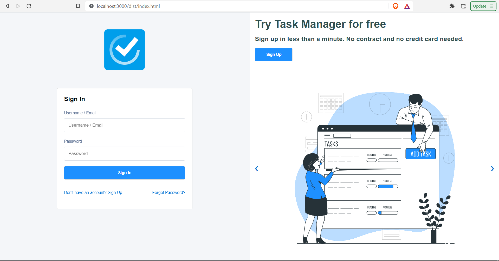

# TaskManager Login UI

A Taskmanager Login UI built using HTML, CSS, Vanilla JS connected to a Node JS [TaskManager API](https://github.com/RudraG4/taskmanager-api)


## Screenshots




## Tech Stack

**Client:** HTML, CSS, Vanilla JS

**Build Tool:** Parcel


## Deployment

To deploy this project run

```bash
  npm install
  npm start
```
